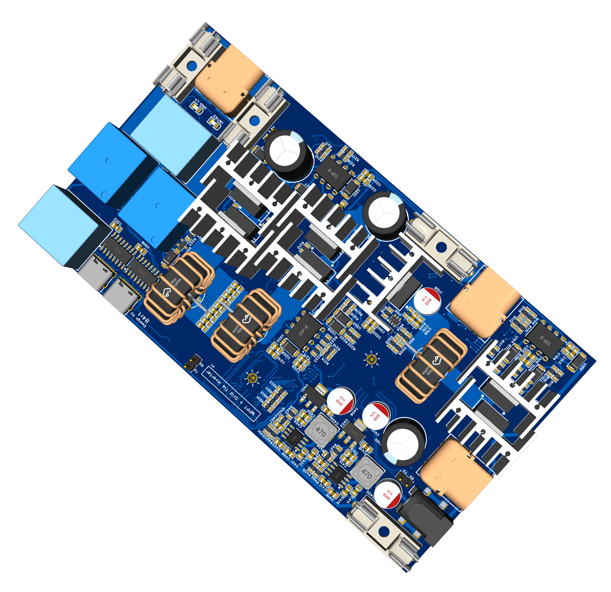
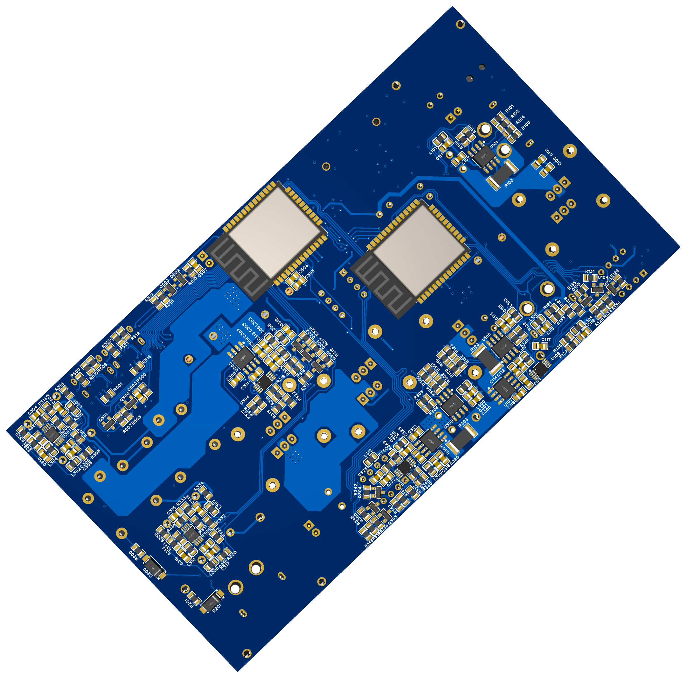

# ESPGI

ESPGI is an ESP32 based grid tie inverter with MPPT solar charger. The idea is that you can attach a ~20V solar panel to the MPPT module that charges the connected ~12v battery optimally, which is also connected to the bi-directional grid tied inverter module that makes sure the battery stays around a target voltage and pushes the extra energy from the solar panel into the (50Hz) electricity grid.

Everything is fully custom made, and by using two ESP32 microcontrollers (one for the MPPT and one for the inverter), many different metrics can polled via a HTTP webserver for monitoring. The entire PCB is custom made and uses a synchronous buck converter for the MPPT, which is controlled by a PWM duty cycle from the ESP32. The inverter is based on a H bridge with many voltage and current sensors that allow locking to the grid phase, voltage and frequency while sampling the AC voltage and current. Based on simple control algorithms a phase and voltage offset is used to regulate charging from and discharging through the grid while maintaining high power factors and doing safety checks. If any safety check fails, the relays will open and disconnect the inverter from the grid until manual reset.

The idea is that this inverter can handle at least 100W of power, although only tested for up to 40W while staying near room temperature.

The PCB project + schematic can be found in the PCB folder, the MPPT and inverter platform.io projects are in the Software folder.

Note that a 230V to 7.18V (toroidal) transformer is required.

